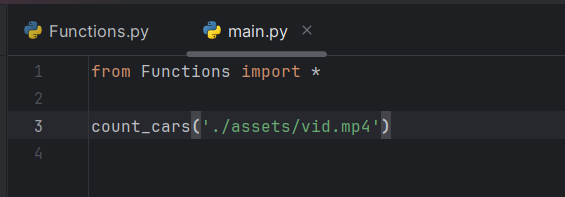

## Description
This is a project which detects cars from a video stream and counts the number of cars passing.

## Table of Contents
1. [Installation](#installation)
2. [Usage](#usage)


## Installation

To install this project, follow these steps:

1. Clone the repository:
   ```bash
   git clone https://github.com/vanyan12/Project-S1.git
   ```

2. Install dependencies:
   ```bash
   pip install -r requirements.txt
   ```
## Usage



Import Functions.py file and call the `count_cars() ` function.

### Syntax: `count_cars(video_stream, interval_t)`

**Parameters**:
-`video_stream`: The path of the video.
-`interval_t`: The time interval during which the number of cars should be counted. By default is 15s.

**Returns**:
- Does not return any value. Creates text file called `data.txt` in the working directory containing information about the time when car is passed.

